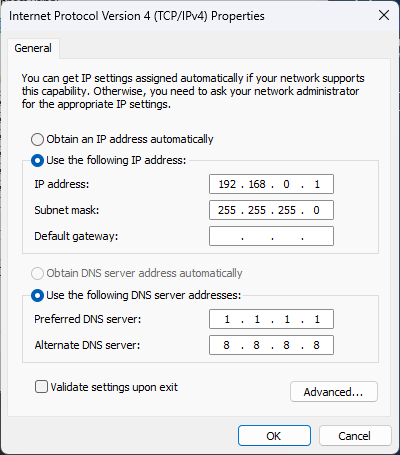
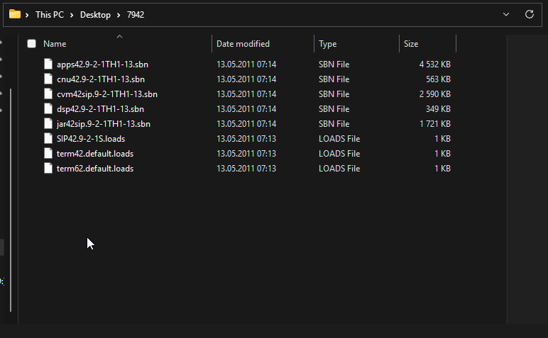
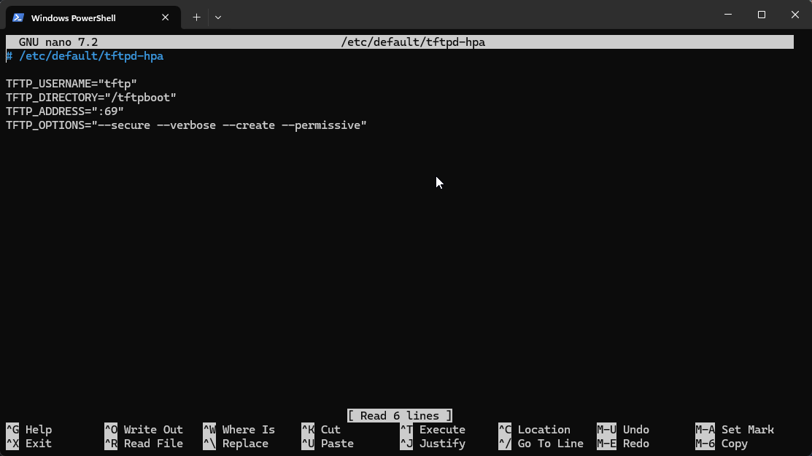
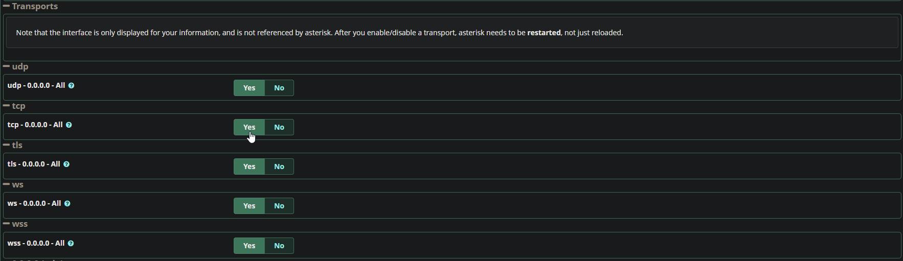

# How to Register Cisco 7900 Series Phones to FreePBX


## Note
All of the content of this repository is taken from my website as it is easier to add stuff here rather than on the website.
https://buba.pw/tutorial

## Introduction
Welcome! This tutorial will guide you through the process of setting up [Cisco 7900](https://www.cisco.com/c/en/us/products/collaboration-endpoints/unified-ip-phone-7900-series/index.html) phones to work with [FreePBX](https://www.freepbx.org/).

For [clabretro](https://www.youtube.com/@clabretro), I've found SIP firmware for 7965 phones. You can download it from the official Cisco link below:

[**SIP Firmware**](https://software.cisco.com/download/home/281346596/type/282074288/release/9.4(2)SR3)

If you don’t have a Cisco account or can’t download it, email me, and I'll send it to you. Make sure to download:

```
cmterm-7945_7965-sip.9-4-2-1SR3-1.zip
```

---

## Steps

### 1. Reset Your Phone
1. Power down the phone by unplugging the 48VDC PoE Ethernet cable or power adapter.
2. Plug the power source back in while holding the `#` key. Keep holding it until the line buttons start flashing.
3. When the line buttons flash, press `123456789*0#`.

### 2. Set Up a TFTP Server to Upgrade the Phone Firmware to SIP
1. Install [Tftpd64](https://pjo2.github.io/tftpd64/) on a Windows machine.
2. Configure your Ethernet adapter settings as shown:
   
   

3. Open Tftpd64 and adjust the settings as shown:
   
   

4. Set the "Current Directory" to the folder containing the firmware files:
   
   

### 3. Upgrade the Phone Firmware
1. Connect the phone to a PoE switch (or non-PoE switch with a power injector). Cisco 7900 series phones have known issues with auto MDI-X.
2. Power on the phone. It will display the "Upgrading" screen.
3. Wait for the phone to display an IP address and begin downloading files from the TFTP server. You can monitor this in Tftpd64.
4. Once the phone finishes downloading, it will reboot automatically.

### 4. Set Up a TFTP Server on FreePBX
1. Install the TFTP server on Debian 12:

   ```sh
   sudo apt install tftpd-hpa
   ```

   **Note:** `tftpd-hpa` is often installed along with FreePBX.

2. Configure the TFTP server by editing `/etc/default/tftpd-hpa`:

   

3. Restart the TFTP server:

   ```sh
   sudo systemctl restart tftpd-hpa.service
   ```

### 5. Provision the Phone
1. Upload the configuration file (e.g., `SEP[MAC_ADDRESS].cnf.xml`) to the TFTP server directory (typically `/tftpboot` or `/srv/tftp`).
2. Some phones are picky about config files, so try one of these:
   
   - [Download 2012 Config](files/SEP(mac_address)_2012.cnf.xml)
   - [Download 2014 Config](files/SEP(mac_address)_2014.cnf.xml)
   
3. Upload `dialplan.xml` to the same directory:
   
   - [Download Dialplan](files/dialplan.xml)

4. Configure the phone:
   - Press the **Checkmark** button → `Network Configuration` → `IPv4 Configuration` → `Alternate TFTP`
   - Press `**#` to unlock settings
   - Click `Yes` to enable Alternate TFTP
   - Scroll to `TFTP Server 1` and set it to the TFTP server's IP
5. Restart the phone. It should provision automatically.

### 6. Enable TCP Transport in FreePBX (If the Phone Does Not Register)
1. Go to **Settings** → **Asterisk SIP Settings** → **SIP Settings [chan_pjsip]** in the FreePBX admin panel.
2. Adjust the transport settings as shown:
   
   

3. Click **Submit** and **Apply Config**, then restart FreePBX and the phone.

---

### 7. Custom Backgrounds
You can customize the background of your Cisco 7900 series phones by adding a `Desktops` directory to the TFTP server directory where `SEP[MAC_ADDRESS].cnf.xml` and `dialplan.xml` are stored.

1. Create the following directory structure:
   ```
   /tftpboot/Desktops/320x196x4/
   ```
2. Place your custom background images in `320x196x4/`. These must be in 320x196 resolution with 4-bit color depth or monochrome.
3. Add a `List.xml` file inside the `320x196x4/` directory to specify available backgrounds.
4. Example `List.xml` format:
   ```xml
   <CiscoIPPhoneImageList>
    <ImageItem Image="TFTP:Desktops/320x196x4/ubuntu-tn.png"
       URL="TFTP:Desktops/320x196x4/ubuntu.png"/>
    <ImageItem Image="TFTP:Desktops/320x196x4/tux-tn.png"
       URL="TFTP:Desktops/320x196x4/tux.png"/>
    </CiscoIPPhoneImageList>
   ```
5. Restart the phone and navigate to the settings to select the new background.

6. Background images themselves are as the name suggests 320 by 196 pixels, and the thumbnails need to be 80 by 49 so 25% of the backround image.

---

### 8. Phonebook
I have been doing some tinkering and made a kind of phonebook by accident. If you want a phone book of sorts then I've attached a folder called [phonebook](phonebook/). In there there are PHP files, index.html we're interested about. Place the files in `/var/www/html/webapp` directory. It reads off of a database and returns the values with cisco phone format. you need to make a database called "phonebook" and a table "employees":
   ```sql
   CREATE DATABASE phonebook;
   USE phonebook;
   CREATE TABLE employees (
   id INT AUTO_INCREMENT PRIMARY KEY,
   name VARCHAR(100) NOT NULL,
   phone VARCHAR(20) NOT NULL
   );
   ```
   Next create a user that can access that database:
   ```sql
   CREATE USER 'user'@'%' IDENTIFIED BY 'password';
   GRANT ALL PRIVILEGES ON phonebook.* TO 'user'@'%';
   ```
   Next you want to go to the [phone config](files/SEP(mac_address)_2014.cnf.xml) and find:
   ```xml
   <servicesURL></servicesURL>
   ```
   and add a URL like this:
   ```xml
   <servicesURL>http://freepbx_ip_address/webapp/index.php</servicesURL>
   ```
   Go to `http://freepbx_ip_address/webapp/contacts.php` to manage your contacts.
   Also remember to change database credentials in the PHP files.

## Contact
If you have any questions, feel free to reach out at [kubab945@gmail.com](mailto:kubab945@gmail.com).

&copy; 2025 [buba.pw](https://buba.pw)

