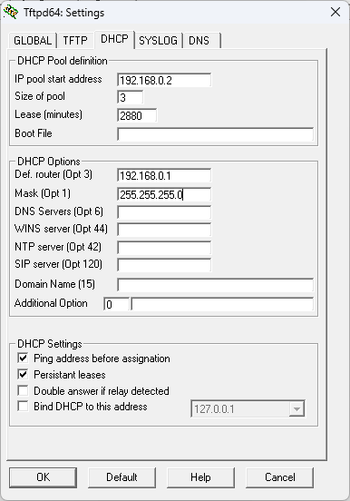

# How to Register Cisco 7900 Series Phones to FreePBX


## NOTE
All of the content of this repository is taken from my website as it is easier to add stuff here rather than on the website.
https://buba.pw/tutorial

## NOTE 2
I TESTED THIS ONLY ON 7975G and 7942G SO I DON'T KNOW IF IT WORKS ON OTHER MODELS, FEEL FREE TO TEST AND SHARE YOUR EXPERIENCES!!!!

## Introduction
Welcome! This tutorial will guide you through the process of setting up [Cisco 7900](https://www.cisco.com/c/en/us/products/collaboration-endpoints/unified-ip-phone-7900-series/index.html) phones to work with [FreePBX](https://www.freepbx.org/).

For [clabretro](https://www.youtube.com/@clabretro), I've found SIP firmware for 7965 phones. You can download it from the official Cisco link below:

[**SIP Firmware**](https://software.cisco.com/download/home/281346596/type/282074288/release/9.4(2)SR3)

If you don’t have a Cisco account or can’t download it, email me, and I'll send it to you. Make sure to download:

```
cmterm-7945_7965-sip.9-4-2-1SR3-1.zip
```

---

## Steps

### 1. Reset Your Phone
1. Power down the phone by unplugging the 48VDC PoE Ethernet cable or power adapter.
2. Plug the power source back in while holding the `#` key. Keep holding it until the line buttons start flashing.
3. When the line buttons flash, press `123456789*0#`.

### 2. Set Up a TFTP Server to Upgrade the Phone Firmware to SIP
1. Install [Tftpd64](https://pjo2.github.io/tftpd64/) on a Windows machine.
2. Configure your Ethernet adapter settings as shown:
   
   

3. Open Tftpd64 and adjust the settings as shown:
   
   

4. Set the "Current Directory" to the folder containing the firmware files:
   
   

### 3. Upgrade the Phone Firmware
1. Connect the phone to a PoE switch (or non-PoE switch with a power injector). Cisco 7900 series phones have known issues with auto MDI-X.
2. Power on the phone. It will display the "Upgrading" screen.
3. Wait for the phone to display an IP address and begin downloading files from the TFTP server. You can monitor this in Tftpd64.
4. Once the phone finishes downloading, it will reboot automatically.

### 4. Set Up a TFTP Server on FreePBX
1. Install the TFTP server on Debian 12:

   ```sh
   sudo apt install tftpd-hpa
   ```

   **Note:** `tftpd-hpa` is often installed along with FreePBX.

2. Configure the TFTP server by editing `/etc/default/tftpd-hpa`:

   

3. Restart the TFTP server:

   ```sh
   sudo systemctl restart tftpd-hpa.service
   ```

### 5. Provision the Phone
1. Upload the configuration file (e.g., `SEP[MAC_ADDRESS].cnf.xml`) to the TFTP server directory (typically `/tftpboot` or `/srv/tftp`).
2. Some phones are picky about config files, so try one of these:
   
   - [Download 2012 Config](files/SEP(mac_address)_2012.cnf.xml)
   - [Download 2014 Config](files/SEP(mac_address)_2014.cnf.xml)
   
3. Upload `dialplan.xml` to the same directory:
   
   - [Download Dialplan](files/dialplan.xml)

4. Configure the phone:
   - Press the **Checkmark** button → `Network Configuration` → `IPv4 Configuration` → `Alternate TFTP`
   - Press `**#` to unlock settings
   - Click `Yes` to enable Alternate TFTP
   - Scroll to `TFTP Server 1` and set it to the TFTP server's IP
5. Restart the phone. It should provision automatically.

### 6. Enable TCP Transport in FreePBX (If the Phone Does Not Register)
1. Go to **Settings** → **Asterisk SIP Settings** → **SIP Settings [chan_pjsip]** in the FreePBX admin panel.
2. Adjust the transport settings as shown:
   
   

3. Click **Submit** and **Apply Config**, then restart FreePBX and the phone.

### 7. Enable G722 Codec in FreePBX for HD voice
By default my config allows you to use HD voice or G722 codec, to make use of this
1. Go to the IP of your FreePBX and log in
2. Once on the dashboard hover over **Settings**
3. Click on **Asterisk SIP Settings**
4. Scroll down to **Codecs**
5. Enable **"g722"** and move it to the top of the list
6. Press Submit and Apply Config
7. For good measure I'd restart both the FreePBX server and the phones

---

### 8. Custom Backgrounds
You can customize the background of your Cisco 7900 series phones by adding a `Desktops` directory to the TFTP server directory where `SEP[MAC_ADDRESS].cnf.xml` and `dialplan.xml` are stored.

Image dimensions for different phone models:
| Phone Model       | Full Image | Thumbnail (25% of full image) | Color Depth | Directory Path           |
|-------------------|-----------------|----------------|-------------|--------------------------|
| **7906G / 7911G** | 95 x 34         | 23 x 8         | Grayscale   | /Desktops/95x34x1        |
| **7941G / 7961G** | 320 x 196       | 80 x 49        | Grayscale   | /Desktops/320x196x4      |
| **7942G / 7962G** | 320 x 196       | 80 x 49        | Grayscale   | /Desktops/320x196x4      |
| **7945G / 7965G** | 320 x 212       | 80 x 53        | 16-bit Color| /Desktops/320x212x16     |
| **7970G / 7971G** | 320 x 212       | 80 x 53        | 12-bit Color| /Desktops/320x212x12     |
| **7975G**         | 320 x 216       | 80 x 54        | 16-bit Color| /Desktops/320x216x16     |

Images should be in PNG format.

1. Create the following directory structure:
   
   For 7942 for example:
   ```
   /tftpboot/Desktops/320x196x4/
   ```
   For 7975:
   ```
   /tftpboot/Desktops/320x216x16/
   ```

2. Place your custom background images in `320x196x4/` or `320x196x4/`. These must be in 320x196 resolution with 4-bit color depth or monochrome, if made for 7942. Refer to the table above for your phone's display details.
3. Add a `List.xml` file inside the desired directory eg: `320x196x4` or `320x216x16`  to specify available backgrounds.
4. Example `List.xml` format:
   ```xml
   <CiscoIPPhoneImageList>
    <ImageItem Image="TFTP:Desktops/320x196x4/ubuntu-tn.png"
       URL="TFTP:Desktops/320x196x4/ubuntu.png"/>
    <ImageItem Image="TFTP:Desktops/320x196x4/tux-tn.png"
       URL="TFTP:Desktops/320x196x4/tux.png"/>
    </CiscoIPPhoneImageList>
   ```
5. Restart the phone and navigate to the settings to select the new background.

---

### 9. Custom ringtones
I provided a list of cutom ringtones with `.raw` and a [ringlist.xml](files/ringlist.xml) file for 7900 series phones. You need to puth both in the tftp root directory. As for 8800 series, you need a [Ringlist-wb.xml](files/Ringlist-wb.xml) file, it support `.raw` ringotnes that are for the 7900 series and `.rwb` ringtones which are wideband ringtones for the 8800 series specifficaly and will not work for 7900 series.

To make custom ringtones:
1. For 7900 series and 8800 series (LQ)
   - get [Audacity](https://www.audacityteam.org/)
   - import your ringtone and keep it to about 30s
   - Click File → Export Audio... and export with these settings. 

   

   - Put this file in the tftp root
   - Add entry to the [ringlist.xml](files/ringlist.xml) and/or [Ringlist-wb.xml](files/Ringlist-wb.xml)
   ```xml
      <Ring>
		   <DisplayName>Ringtone</DisplayName>
		   <FileName>ringtone.raw</FileName>
	   </Ring>
   ```
2. For 8800 series ONLY
   - get [Audacity](https://www.audacityteam.org/)
   - import your ringtone and keep it to about 30s
   - Click File → Export Audio... and export with these settings.

   
   
   
   Note: change `.raw` to `.rwb` file extension

   - Put this file in the tftp root
   - Add entry to the [Ringlist-wb.xml](files/Ringlist-wb.xml)
   ```xml
      <Ring>
		   <DisplayName>Ringtone</DisplayName>
		   <FileName>ringtone.rwb</FileName>
	   </Ring>
   ```

---

### 10. Cisco 8800 series phones
Configuration is the same as 7900 series, config is a bit different but I provided it aswell. You need to put [ITLFile.tlv](files/ITLFile.tlv) (courtesy of [Ryan Kim](https://github.com/csptechnologies)) and [softkeys.xml](files/softkeys.xml) in the tftp root directory. for this to work. If you experience any issues with 8800 series phones open a [GitHub issue](https://github.com/buba0/Cisco-7900-series-freepbx-setup/issues).

---

### 11. Phonebook
I have been doing some tinkering and made a kind of phonebook by accident. If you want a phone book of sorts then I've attached a folder called [phonebook](phonebook/). In there there are PHP files, index.html we're interested about. Place the files in `/var/www/html/webapp` directory. It reads off of a database and returns the values with cisco phone format. you need to make a database called "phonebook" and a table "employees":
   ```sql
   CREATE DATABASE phonebook;
   USE phonebook;
   CREATE TABLE employees (
   id INT AUTO_INCREMENT PRIMARY KEY,
   name VARCHAR(100) NOT NULL,
   phone VARCHAR(20) NOT NULL
   );
   ```
   Next create a user that can access that database:
   ```sql
   CREATE USER 'user'@'%' IDENTIFIED BY 'password';
   GRANT ALL PRIVILEGES ON phonebook.* TO 'user'@'%';
   ```
   Next you want to go to the [phone config](files/SEP(mac_address)_2014.cnf.xml) and find:
   ```xml
   <servicesURL></servicesURL>
   ```
   and add a URL like this:
   ```xml
   <servicesURL>http://freepbx_ip_address/webapp/index.php</servicesURL>
   ```
   Now when you press the globe icon on the phone the service will show a list of users that you put in.

   In the [index.php](phonebook/index.php) there is a variable called `$limit = X` where X is the number of contacts per page. If there is more entries in the phonebook than the value of this variable, the directory/phonebook will have a softkey "Next" and "Previous"

   Go to `http://freepbx_ip_address/webapp/contacts.php` to manage your contacts.
   ***UPDATE DATABASE CREDENTIALS IN [THE CONFIG FILE](phonebook/config.php) FOR THE SERVICE TO WORK***

---

## Contact
If you have any questions, feel free to reach out at [kubab945@gmail.com](mailto:kubab945@gmail.com).

Or open a [GitHub issue](https://github.com/buba0/Cisco-7900-series-freepbx-setup/issues).

&copy; 2025 [buba.pw](https://buba.pw)
## Star History

[](https://www.star-history.com/#buba0/Cisco-7900-series-freepbx-setup&Date)
